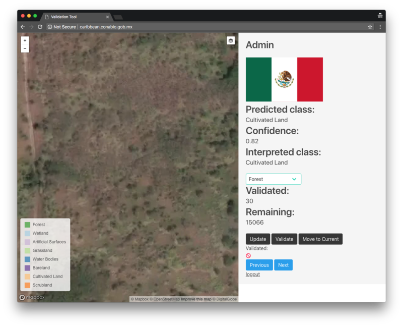

## Introduction

In the context of the project that aims to create a landcover classification using RapidEye imagery, this tool was developed at The Mexican Commission for the Knowledge and Use of Biodiversity (CONABIO) to validate the results obtained using the MAD-Mex system. The tool consist of a graphical interface that allows to correct and validate automatically classified polygons. The purpose of this tool is to obtain better training data to create a final classification map with a joint effort between countries. To overcome the daunting task of correcting by hand over 100 million polygons we made a stratified sampling over the cross product of the landcover classes and the countries. We ended up with 15,096 polygons which are editable through this interface. The system and the database are hosted in servers at CONABIO and available at http://caribbean.conabio.gob.mx/.

## Login

To login into the application the user most provide a user name and password:

When the user logs in, a panel will appear with a map in the left and some information in the right.

The polygons to be edited will appear in the map with the opacity set to *50%*. It is posible to hide the polygon layer by hovering the overlay menu and unchecking the box:

This will help to gather information that adds to the evidence of the real class that the polygon belogns to.

The map allows to move around the area and zooming in and out usign the mouse wheel or the buttons in the upper left corner. Doing this the user can find other polygons in the area which will be highlighted by colouring the perimeter in red. Using the day button **Move to Current** the map will zoom back to the current selected object which will have its boundary in black. The *Next* and *Previous* buttons let the user to navigate through the polygons. The order in which the polygons are shown is not consistend and may change between logs. What is consistent is that unvalidated polygons will be shown first when the application loads.

The tool allows the user to change the classification for the selected object. If the evidence points that a polygon is missclassified, the tag can be changed by selecting the correct class in the dropdown list, and clicking on the **Update** button. The color of the polygon will immediately change with the one corresponding to the new tag. If, and only if, the user is completely sure of the new tag, the **Validate** button must be pressed, this will update the counter for validated and remaining objects and will change the opacity of the polygon. While the class will be still editable after validating a polygon, unvalidated polygons will be prioritised in the pecking order when the application loads, so a validated object will be harder to find.

It is important to note that the application has not been tested for concurrent use, so we strongly advise not to use the same credentials in different sessions simultaneously. When the user finishes using the application, they must press the logout link. 

This screen will be shown:

